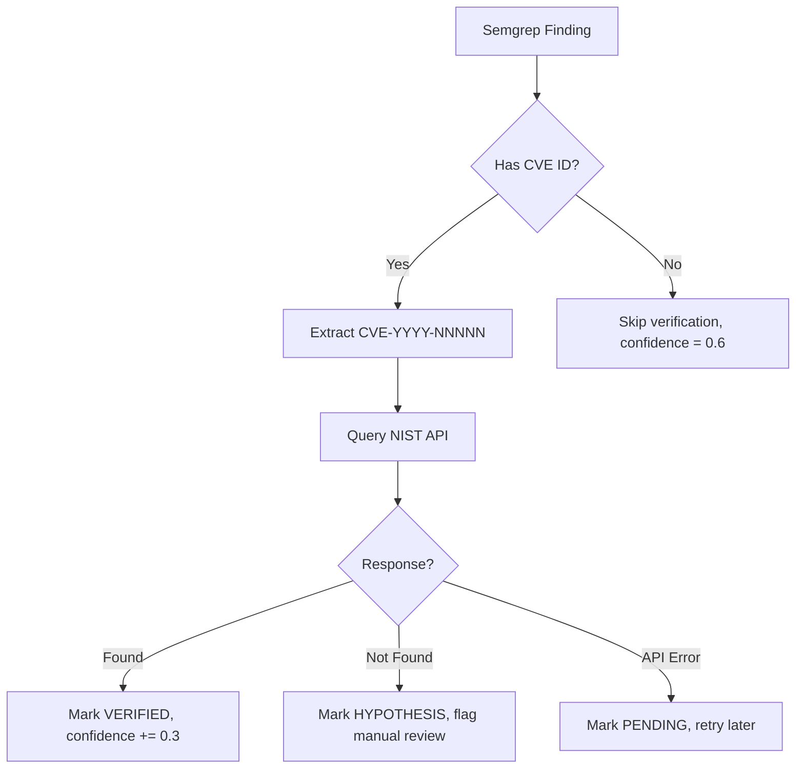

# CVE Verification Protocol (Level 2 Reference)

## NIST NVD API Specification

**Base URL:** `https://services.nvd.nist.gov/rest/json/cves/2.0`

### Rate Limits
- **Without API key:** 5 requests per 30 seconds
- **With API key:** 50 requests per 30 seconds

**Current setup:** No API key (sufficient for <20 findings per scan)

### Request Format
```bash
curl -s "https://services.nvd.nist.gov/rest/json/cves/2.0?cveId=CVE-2023-12345"
```

### Response Parsing
```bash
# Check if CVE exists
RESULT_COUNT=$(echo $RESPONSE | jq -r '.resultsPerPage')

if [ "$RESULT_COUNT" == "0" ]; then
  STATUS="NOT_FOUND"
else
  STATUS="VERIFIED"
  DESCRIPTION=$(echo $RESPONSE | jq -r '.vulnerabilities[0].cve.descriptions[0].value')
  SEVERITY=$(echo $RESPONSE | jq -r '.vulnerabilities[0].cve.metrics.cvssMetricV31[0].cvssData.baseSeverity')
fi
```

## Error Handling

### Case 1: NIST API Down (HTTP 503)
```bash
if [ "$HTTP_CODE" == "503" ]; then
  echo "⚠️ NIST API temporarily unavailable"
  # Fallback: mark finding as [PENDING_VERIFICATION]
  # Add to manual review queue
  # Do NOT block report generation
fi
```

### Case 2: CVE Not Found (resultsPerPage = 0)
```bash
# This is EXPECTED for some semgrep findings
# Mark as [HYPOTHESIS], include in report appendix
# Do NOT remove from report entirely (customer should know)
```

### Case 3: Rate Limit Exceeded (HTTP 429)
```bash
# Implement exponential backoff
sleep 30  # Wait 30 seconds
# Retry request
# If still fails → batch verification, complete later
```

## Verification Workflow



## Testing CVE Verification

```bash
# Known valid CVE (should return VERIFIED)
curl -s "https://services.nvd.nist.gov/rest/json/cves/2.0?cveId=CVE-2021-44228" | jq '.resultsPerPage'
# Expected: 1

# Known invalid CVE (should return NOT_FOUND)
curl -s "https://services.nvd.nist.gov/rest/json/cves/2.0?cveId=CVE-9999-99999" | jq '.resultsPerPage'
# Expected: 0
```

## Rate Limiting Strategy

```bash
# For scans with <10 CVEs
for CVE in $CVE_LIST; do
  verify_cve "$CVE"
  sleep 0.2  # 200ms = 5 req/sec (at limit)
done

# For scans with >20 CVEs (future: batch mode)
# Split into batches of 20
# Process each batch with delays
# Aggregate results
```

## Logging

Every NIST API call must be logged:
```json
{
  "timestamp": "2026-04-20T15:30:45Z",
  "cve_id": "CVE-2023-12345",
  "nist_status": "VERIFIED",
  "http_code": 200,
  "description": "SQL Injection in...",
  "severity": "HIGH"
}
```

**Log location:** `/tmp/nist-verification-$TIMESTAMP.log`

**Purpose:** Debugging, audit trail, rate limit tracking
